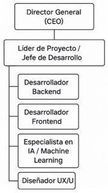

# UNIVERSIDAD PRIVADA DE TACNA

**FACULTAD DE INGENIERÍA**  
**Escuela Profesional de Ingeniería de Sistemas**

**Proyecto**  
**“Generador de documentación impulsado por IA (GDI-IA)”**

**Curso:**  
*Calidad y Pruebas de Software*

**Docente:**  
*Mag. Patrick Cuadros Quiroga*

**Integrantes:**
- Ancco Suaña, Bruno Enrique (2023077472)
- Akhtar Oviedo, Ahmed Hasan (2022074261)
- Ayala Ramos, Carlos Daniel (2022074266)
- Salas Jiménez, Walter Emmanuel (2022073896)

**Tacna – Perú**  
**2025**

 

---

|**Versión**|**Hecha por**|**Revisada por**|**Aprobada por**|**Fecha**|**Motivo**|
|:--:|:--|:--|:--|:--|:--|
|1.0|AHAO, CDAR, WESJ, BEAS|PCQ|-|01/06/2025|Versión 1.0|
|2.0|AHAO, CDAR, WESJ, BEAS|PCQ|-|01/06/2025|Versión 2.0|

---

---

## Introducción

El presente documento de Especificación de Requerimientos de Software (ERS) describe de manera detallada las funcionalidades, restricciones y características necesarias para el desarrollo del proyecto **Generador de Documentación Impulsado por IA (GDI-IA)**, propuesto para DevStar Solutions.  
El objetivo principal es diseñar e implementar una plataforma web inteligente que asista en la generación automatizada de documentos formales, utilizando tecnologías de inteligencia artificial especializadas en redacción, análisis de contenido y formateo estructurado.

---

## I. Generalidades de la Empresa

### 1. Nombre de la Empresa
**DevStar Solutions**

### 2. Visión
Ser reconocidos como la empresa líder (Top 1) en la creación de soluciones de software innovadoras y de alta calidad a nivel nacional e internacional.

### 3. Misión
Ofrecer productos y servicios de software que integren tecnologías emergentes, como la inteligencia artificial, para resolver de manera eficiente las necesidades de nuestros clientes, mejorando su productividad y competitividad en el mercado.

### 4. Organigrama

## II. Visionamiento de la Empresa

### 1. Descripción del Problema
Actualmente, muchas organizaciones y profesionales pierden tiempo valioso en la elaboración manual de documentos formales. Esta falta de automatización genera costos innecesarios, retrasa la entrega de proyectos y afecta la eficiencia operativa. DevStar Solutions identificó la necesidad de una plataforma que permita automatizar la generación de documentos estructurados utilizando IA, optimizando tiempos y asegurando calidad.

### 2. Objetivos de Negocios
- Incrementar el portafolio de soluciones innovadoras de DevStar Solutions.
- Mejorar la eficiencia interna y de los clientes mediante automatización documental.
- Posicionar a la empresa como referente en IA aplicada a la productividad empresarial.
- Generar nuevas fuentes de ingresos con un modelo SaaS escalable.

### 3. Objetivos de Diseño
- Desarrollar una plataforma web intuitiva, segura y accesible.
- Integrar motores de IA para la generación eficiente de contenido.
- Garantizar alta disponibilidad, confiabilidad y rendimiento.
- Permitir personalización de formatos documentales.

### 4. Alcance del proyecto
El proyecto contempla el desarrollo de una plataforma web que permita:
- Capturar información guiada de usuarios.
- Procesar dicha información usando IA.
- Generar documentos en PDF y DOCX.
- Gestionar el historial de documentos creados.
- Brindar acceso por suscripción a funcionalidades premium.

### 5. Viabilidad del Sistema
El análisis realizado (técnico, operativo, legal y financiero) demuestra que el proyecto es viable:
- Infraestructura tecnológica adecuada.
- Personal calificado.
- Tendencia favorable del mercado.
- VAN positivo y relación B/C favorable.

### 6. Información obtenida del Levantamiento de Información
- Alta demanda de automatización documental en sectores académicos y tecnológicos.
- Interés de usuarios potenciales en soluciones accesibles y fáciles de usar.
- Necesidad de reducir tiempos de entrega de documentos formales.
- Limitada oferta de plataformas con integración modular de IA.
