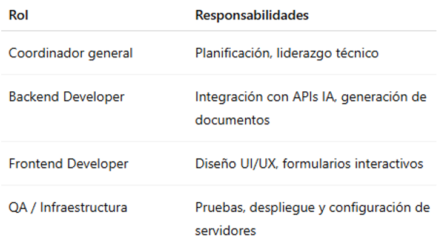
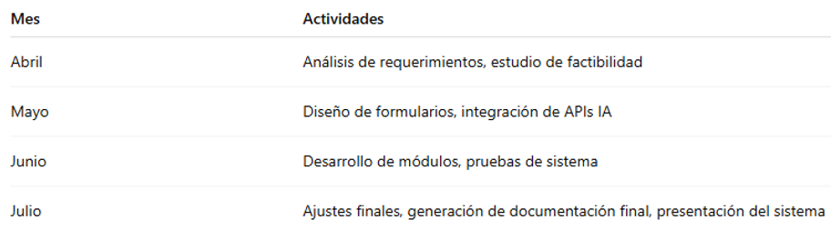

# UNIVERSIDAD PRIVADA DE TACNA

## FACULTAD DE INGENIERÍA

### Escuela Profesional de Ingeniería de Sistemas

## Proyecto

**“Generador de documentación impulsado por IA (GDI-IA)”**

**Propuesta de Proyecto**

**Curso:**  
*Calidad y Pruebas de Software*

**Docente:**  
*Mag. Patrick Cuadros Quiroga*

**Integrantes:**
- *Ancco Suaña, Bruno Enrique (2023077472)*
- *Akhtar Oviedo, Ahmed Hasan (2022074261)*
- *Ayala Ramos, Carlos Daniel (2022074266)*
- *Salas Jiménez, Walter Emmanuel (2022073896)*

**Tacna – Perú**  
**2025**

 

---

| **Versión** | **Hecha por** | **Revisada por** | **Aprobada por** | **Fecha**   | **Motivo**        |
|:-----------:|:-------------:|:----------------:|:----------------:|:-----------:|:------------------|
| 1.0         | AHAO, CDAR, WESJ,BEAS           | PCQ        |             | 8/06/2025  | Versión Original  |

## Tabla de Contenido

1. [Resumen Ejecutivo](#resumen-ejecutivo)
2. [Propuesta Narrativa](#propuesta-narrativa)
3. [Presupuesto](#presupuesto)
4. [Análisis de Factibilidad](#análisis-de-factibilidad)
5. [Evaluación Financiera](#evaluación-financiera)
6. [Anexos](#anexos)

---

## Resumen Ejecutivo

**Nombre del Proyecto propuesto:**  
Generador de Documentación Impulsado por IA (GDI-IA) – Tacna, 2025

**Propósito del Proyecto y Resultados esperados:**  
Desarrollar una plataforma web basada en inteligencia artificial que automatice la generación de documentos técnicos en formatos estandarizados, reduciendo el esfuerzo manual, los errores de formato y mejorando la productividad del equipo técnico.

**Resultados esperados:**
- Plataforma accesible desde navegador web.
- Integración de modelos IA para redacción y generación de diagramas.
- Exportación de documentos en PDF y DOCX.
- Gestión de historial y almacenamiento en servidor FTP.
- Interfaz amigable y multiformato.

**Población Objetivo:**  
Desarrolladores, estudiantes, profesionales técnicos, equipos de proyectos y entidades académicas.

**Monto de Inversión:**  
S/. 1,300.00

**Duración del Proyecto:**  
4 meses

---

## I. Propuesta Narrativa

### Planteamiento del Problema

Los equipos de desarrollo enfrentan dificultades para elaborar documentación técnica clara, precisa y estandarizada. Este proceso consume tiempo valioso, es propenso a errores y depende mucho del criterio de cada usuario.

### Justificación del Proyecto

La automatización de la documentación técnica permite mejorar la calidad, reducir los errores humanos y liberar recursos para tareas más críticas. La herramienta propuesta se alinea con la tendencia de aplicar IA en procesos de productividad.

### Objetivo General

Desarrollar una plataforma web inteligente que automatice la generación de documentos técnicos mediante IA, siguiendo formatos predefinidos.

### Beneficios

- **Tangibles:**
  - Ahorro de tiempo en la generación documental.
  - Reducción de errores.
  - Menor necesidad de intervención manual.
- **Intangibles:**
  - Mejora en la comunicación y la eficiencia organizacional.
  - Imagen corporativa más profesional.
  - Adopción de nuevas tecnologías.

### Alcance

- Formatos FD01–FD06.
- Generación de bibliografía, imágenes y diagramas.
- Exportación a DOCX/PDF.
- Soporte para múltiples idiomas.
- Acceso por navegador web.

### Requerimientos del Sistema

Ver **Anexo 01 – Requerimientos funcionales y no funcionales del sistema** (con base en FD03).

### Restricciones

- Requiere conexión a internet.
- Dependencia de APIs externas para IA.
- No incluye edición manual posterior en la plataforma.

### Supuestos

- Disponibilidad de servicios IA y APIs de terceros.
- Acceso a infraestructura web básica (hosting, dominio, FTP).
- Adopción positiva por parte de los usuarios.

### Resultados Esperados

- Plataforma funcional para generación automatizada de documentos.
- Documentos generados con estándares institucionales.
- Mejora del flujo de trabajo documental.

### Metodología de Implementación

Se utilizó una metodología incremental, con iteraciones que abarcaron análisis, diseño, desarrollo, pruebas e implementación.  
Herramientas empleadas: PHP, HTML, JavaScript, MySQL, OpenAI y TCPDF.

### Actores Claves

- **Usuarios finales:** Estudiantes, técnicos, desarrolladores.
- **Desarrolladores del sistema:** Encargados del backend y frontend.
- **Administrador:** Control del sistema, configuración de modelos IA.

### Papel y Responsabilidades del Personal

### Plan de Monitoreo y Evaluación

- **Semanal:** Seguimiento del avance por módulo.
- **Mensual:** Pruebas funcionales y revisión con usuarios.
- **Final:** Evaluación del cumplimiento de objetivos, métricas de uso, encuestas de satisfacción.

### Cronograma del Proyecto

### Hitos de Entregables

- Documento de visión y requisitos (mayo)
- Módulo de generación de documentos (junio)
- Plataforma funcional con exportación (junio)
- Informe final y despliegue completo (julio)

## II. Presupuesto

**Planteamiento de Aplicación del Presupuesto:**  
Los recursos se destinan al desarrollo, hosting, licencias de software y personal técnico.

**Presupuesto:**  
*(Incluir tabla con desglose de costos estimados)*

## III. Análisis de Factibilidad

El sistema es técnica y operativamente viable, y su análisis financiero demuestra una TIR mensual de 1.53% y un VAN positivo de S/. 16,568.85 (ver FD01).

## IV. Evaluación Financiera

- **Inversión inicial:** S/. 1,300.00
- **Relación B/C:** 13.81
- **VAN:** S/. 16,568.85
- **TIR:** 1.53% mensual

El proyecto es altamente rentable y recupera su inversión rápidamente.

## Anexos

- **Anexo 01:** Requerimientos del Sistema (funcionales y no funcionales, resumen de FD03)

